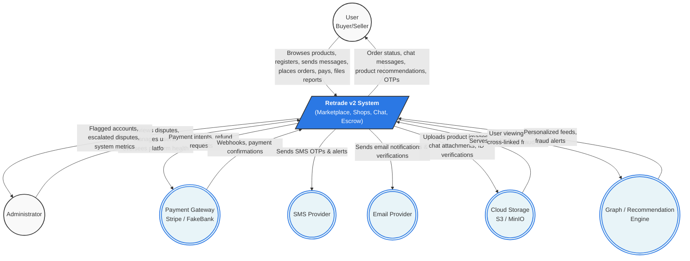

# Context Diagram (Level 0 DFD)

The Context Diagram defines the boundary of the **Retrade v2 System**, illustrating how it interacts with external entities such as users, administrators, and third-party services (payment gateways, notification providers, and cloud storage).

## System Context Visualization

## External Entities Overview

1. **User (Buyer/Seller)**: The primary actor interacting with the platform. They can explore marketplace items or dedicated shops, communicate, initiate escrow transactions, and flag issues.
2. **Administrator**: Platform moderators responsible for observing and resolving disputes, verifying identities, and actioning fraud flags.
3. **Payment Gateway**: Third-party APIs processing fiat and simulated ("Fake Bank") transactions, receiving payment instructions and emitting webhooks.
4. **Cloud Storage (S3/MinIO)**: Remote object storage that retains heavy media items like listing pictures, chat attachments, and submitted ID verifications.
5. **Graph / Recommendation Engine**: External Go-based microservices mapping relationships for personalized feeds and capturing fraud rings.
6. **SMS & Email Providers**: Standard outgoing communication endpoints delivering Multi-Factor Authentication (OTP) codes and order receipts.
