# Data Flow Diagram (Level 1 DFD)

The Level 1 Data Flow Diagram (DFD) breaks down the primary "Retrade v2 System" from the Context Diagram into its major underlying processes and data stores. It shows the flow of data between external entities, core business logic processes, and database verticals.

## Level 1 DFD Visualization

```mermaid
flowchart TD
    %% External Entities
    User((User<br/>Buyer/Seller))
    Admin((Admin))
    PaymentGW(((Payment<br/>Gateway)))
    Storage(((Cloud<br/>Storage)))

    %% Processes
    P1("1. Registration<br/>& Authentication")
    P2("2. Shop & Listing<br/>Management")
    P3("3. Order &<br/>Checkout")
    P4("4. Escrow &<br/>Delivery")
    P5("5. Chat System")
    P6("6. Moderation &<br/>Disputes")

    %% Data Stores
    D1[(D1: User DB)]
    D2[(D2: Catalog DB<br/>Shops/Listings)]
    D3[(D3: Orders &<br/>Payments DB)]
    D4[(D4: Chat DB)]
    D5[(D5: Moderation DB)]

    %% --- Data Flows ---

    %% Registration & Auth
    User -->|"1.1 Credentials, OTP, ID Docs"| P1
    P1 -->|"1.2 Auth Tokens, Profile Data"| User
    P1 <-->|"1.3 Validate/Store Profile"| D1
    P1 -->|"1.4 Upload ID"| Storage

    %% Shop & Listing Management
    User -->|"2.1 Add Product, Edit Shop"| P2
    P2 <-->|"2.2 Read/Write Catalog"| D2
    P2 -->|"2.3 Upload Media"| Storage

    %% Order & Checkout
    User -->|"3.1 Add to Cart, Checkout"| P3
    P3 -->|"3.2 Validate Cart Items"| D2
    P3 -->|"3.3 Store Order Details"| D3
    P3 -->|"3.4 Create Session"| PaymentGW
    PaymentGW -->|"3.5 Webhook Status"| P3
    P3 -->|"3.6 Payment Confirmation"| User

    %% Escrow & Delivery
    User -->|"4.1 Confirm Delivery (PIN)"| P4
    P4 <-->|"4.2 Lock/Release Funds"| D3
    P4 -->|"4.3 Escrow Payout Notice"| User

    %% Chat System
    User -->|"5.1 Send/Receive Messages"| P5
    P5 <-->|"5.2 Store/Retrieve Messages"| D4
    P5 -->|"5.3 Upload Attachments"| Storage
    P5 -.->|"5.4 Validate Users"| D1

    %% Moderation & Disputes
    User -->|"6.1 File Dispute/Report"| P6
    P6 -->|"6.2 Write Report Log"| D5
    Admin -->|"6.3 Review Evidence"| P6
    P6 <-->|"6.4 Correlate Orders"| D3
    P6 -.->|"6.5 Suspend/Ban User"| D1

    %% Styling
    classDef process fill:#fff,stroke:#2b78e4,stroke-width:2px,color:#333,shape:rect,rx:5;
    classDef ds fill:#f4f4f4,stroke:#666,stroke-width:2px,shape:cylinder;
    classDef entity fill:#eef,stroke:#333,stroke-width:2px;
    classDef service fill:#e8f4f8,stroke:#2b78e4,stroke-width:2px;

    class P1,P2,P3,P4,P5,P6 process;
    class D1,D2,D3,D4,D5 ds;
    class User,Admin entity;
    class PaymentGW,Storage service;
```

## Data Stores Mapping

Based on the system's EERD, here is how the data stores map to the local database schemas:

* **D1: User DB**: `users`, `admins`.
* **D2: Catalog DB**: `shops`, `shop_products`, `carts`, `cart_items` (and MongoDB instances for marketplace listings).
* **D3: Orders & Payments DB**: `orders`, `payment`, `bank`, `escrow`, `payment_sessions`, `webhook_events`.
* **D4: Chat DB**: `chat_rooms`, `chat_messages`, `chat_attachments`.
* **D5: Moderation DB**: `user_reports`, `payment_disputes`.

## Process Breakdown

1. **Registration & Authentication**: Handles user provisioning, JWT access creation, OAuth logins, OTP checks for via Email/SMS, and KYC Identity verification uploads.
2. **Shop & Listing Management**: Evaluates operations that modify the visible state of the merchandise. Caches active views and synchronizes media attachments. 
3. **Order & Checkout**: Turns ephemeral `carts` into finalized `orders`. Dispatches secure payment intents to gateways and locks the session while awaiting webhook triggers.
4. **Escrow & Delivery**: Distinct from checkout, this process governs the lifecycle of funds in transit. Triggers when items arrive, capturing and validating buyer PINs against encrypted escrow records to finally release bank transitions to sellers.
5. **Chat System**: The communication bus ensuring peers can negotiate details asynchronously. Persists all text and enforces association only between existing buyers/sellers.
6. **Moderation & Disputes**: Evaluates flagged behavior and broken escrows. Connects directly to the user tables to suspend privileges, and hooks into `orders`/`payments` to process payment reclamations when users act in bad faith.
