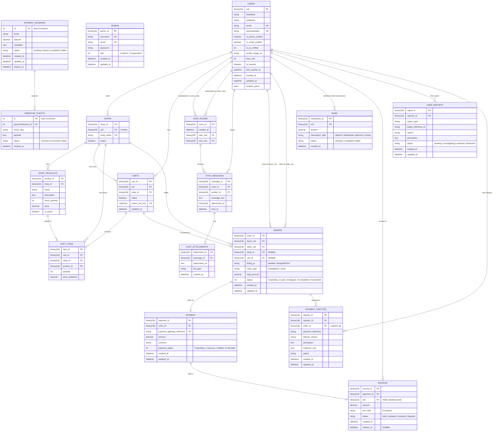

# Enhanced Entity Relationship Diagram (EERD)

This document contains the Enhanced Entity Relationship Diagram (EERD) mapping the database architecture for Retrade v2. The mapping relies on the primary MySQL schema declarations corresponding to the system logic, as well as the backend Pydantic models.

## Schema Overview

The system includes multiple modules working cohesively:
1. **Users & Authentication:** `users`, `admins`
2. **E-Commerce / C2C (Shops):** `shops`, `shop_products`, `carts`, `cart_items`
3. **Peer-to-Peer & Communication:** `chat_rooms`, `chat_messages`, `chat_attachments`
4. **Orders & Transactions:** `orders`, `payment`, `bank`, `escrow`, `payment_sessions`, `webhook_events`
5. **Moderation:** `user_reports`, `payment_disputes`

---

## EERD Visualization

## Relationship Details

### Core Business Domains

1. **User Identity & Context**
   - The `USERS` table serves as the primary anchor point. Practically every other context (Shops, Carts, Chat, Orders, Payments, moderation) leverages `users.uid` as a Foreign Key. This establishes a fully traceable lineage for user transactions and platform interactions.
   
2. **Shop Cart Mechanics**
   - The combination of a Cart (`CARTS`) linking back to a Shop ensures B2B/B2C logic separation from marketplace orders. A cart contains `CART_ITEMS`, which directly reference `SHOP_PRODUCTS`. Upon checkout, a single `CART_ID` can seamlessly spawn an `ORDER_ID`.

3. **Inter-User Communications**
   - The `CHAT_ROOMS` act as a bridge explicitly joining two `users(uid)` elements (`user_one` and `user_two`). Then, `CHAT_MESSAGES` tracks individual messages and dynamically attaches multimedia files via `CHAT_ATTACHMENTS`.

4. **Orders, Escrow & Payment Gateway**
   - A critical link is `ORDERS` branching to `PAYMENT`. Due to the nature of a peer-to-peer and commerce marketplace, every Payment that isn't instantly completed lands in the `ESCROW` table, mapped by `payment_id`, locking funds until released.
   - Pydantic models (like `PaymentDisputeCreate` and `EscrowReleaseRequest`) strongly enforce the validation bridging these tables dynamically.

5. **Moderation Traceability**
   - `PAYMENT_DISPUTES` are deeply connected to the transactional layer by tracing both `reporter_id` (Buyer `uid`) and the relevant `order_id`. Admins triage these logs against `USER_REPORTS` to ban or freeze problematic `users(uid)`.
