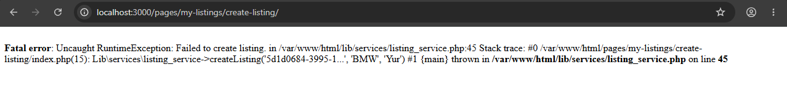

# Issue: MongoDB not writing through PHP

## Severity
- [x] Critical
- [ ] High
- [ ] Medium
- [ ] Low

## Description
We run into a RunTimeExceprion when we try create a listing

```php
Fatal error: Uncaught RuntimeException: Failed to create listing. in /var/www/html/lib/services/listing_service.php:45 Stack trace: #0 /var/www/html/pages/my-listings/create-listing/index.php(15): Lib\services\listing_service->createListing('5d1d0684-3995-1...', 'BMW', 'Yur') #1 {main} thrown in /var/www/html/lib/services/listing_service.php on line 45
```

## Steps to Reproduce
1. Go to `http://localhost:3000/pages/my-listings/create-listing/`
2. Create listing detailes
3. Submit listing

## Expected Behavior
We want it to write the information to a document database for the listing

## Actual Behavior
RuunTimeError fails to create listing

## Environment
- **OS**: Windows 11
- **Browser/Node version**: chrome Dev
- **App version/commit**: 0.0.1

## Additional Context


---

## Possible Fix Options


### Option 1
Move the fix to our python FastAPI so it uses pymongo or motor ORM to write to the mongoDB


## Final Decision (to be completed later)
- [x] Chosen option: 1
- [ ] Implementation notes: 
```
1. Use API service
2. Add a function to write to the mognoDB endpoint
3. In listing service presend the image to minio and get the URL and add it to the mongoDB document payload
4. In Python take the payload and write to mongoDB
```
- [ ] Related PR/commit: